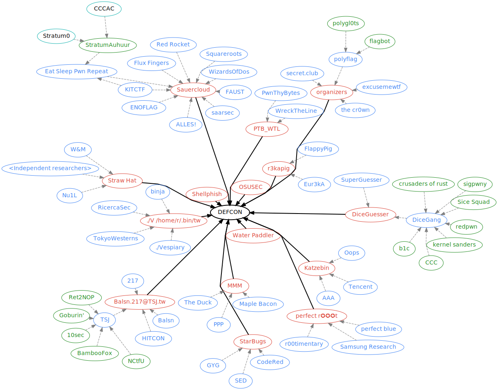

# ctf_clusters

visualizing CTF clusters (teams playing together at DEFCON 2022) (see [github.com/stong/ctf_clusters](https://github.com/stong/ctf_clusters) for 2023).

</img>

## building

Install graphviz with the package manager of your choice.

```
neato -Tsvg teams.dot > teams.svg
```
